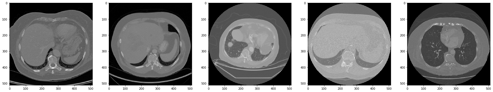
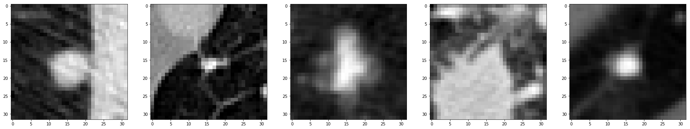

# Lung Nodule Classification in CT scans using Deep Learning

Project for bachelor thesis at Ukrainian Catholic University in collaboration with Center for Machine Perception  of Czech Technical University.

## Description

Accurate nodule detection in computed tomography (CT) scans is an essential
step in the early diagnosis of lung cancer. Radiologists often use Computer-aided
detection (CAD) systems to receive a second opinion during images examination.
Nodule classification is a crucial stage of the full process, which comes as the second
phase in a CAD system, right after candidates detection. Its task is to distinguish
between true nodules and false positives.

The main goal of this thesis was to compare different deep learning methods,
that can be used for nodule classification by evaluating their efficiency on a common
database - LIDC-IDRI. We implemented three neural networks with 2-D convolution
and three with 3-D, tested their performance and reported competitive FROC sensi-
tivity scores. Used methods are compared among themselves and across other stud-
ies. Experimental results demonstrate a strong dependence between higher scores
and 3-D CNNs application. For instance, VGGNet-11 gives 72.1% sensitivity at 8
FPs/scan, while same model with three dimensional convolution - VGGNet-11 3-D
produces 91.9% at 8 FPs/scan rate. 

Based on the obtained results we recommend to
use VGGNet-11 3-D for nodule detection, as it showed the best performance com-
pared to other implemented methods. Moreover, received sensitivity of 91.9% at 8
FPs/scan and 90.6% at 4 FPs/scan rate demonstrates the promise of chosen network
and its competitiveness with the state of the art method, which reported 92.2% at 8
FPs/scan and 90.7% at 4 FPs/scan.

## Dataset

LUNA16 is a competition held in 2016. The goal of this challenge was to compare
different automatic nodule detection systems on a publicly available data set which
includes CT scans, annotations, and a list of candidate regions for the nodules pro-
duced by organizers’ algorithms. As it is stated in the rules of competition, LUNA16
focuses on a large-scale evaluation of automatic nodule detection algorithms on the
LIDC-IDRI dataset.

LIDC-IDRI contains diagnostic and lung cancer screening thoracic computed to-
mography scans with annotated lesions. Seven academic centers and eight medi-
cal imaging companies collaborated to create this data set. It contains 1018 cases:
7371 lesions marked "nodule" by at least one radiologist, 2669 of these lesions were
marked "nodule > or =3 mm" by at least one radiologist. This makes it the largest
publicly available database of CT scans.

Basically, the data set for LUNA challenge consists of images from LIDC-IDRI
database, however, not every annotation from the latest is present in competition.
In particular, non-nodules, nodules < 3 mm, and nodules annotated by only 1 or 2
radiologists are considered irrelevant and thus, are not included. The organizers
of the challenge extracted 1,186 lung nodules from LIDC-IDRI images and formed a
data set from these nodules as positive candidates.

 

The regions of interest for us are 3-D voxels containing nodules, this is why we need to cut out chunks from
each scan. These extracted regions will be the input data for neural networks. To per-
form this step we take ROI candidates, which are proposed in LUNA16 challenge.

All in total we have 551,065 candidates which include 1,186 true nodules.
The three dimensional candidate contains a lesion positioned in the center but it
also has a lot of background around it. Since nodules can be of a different size, some
slices consist mainly of background and usually only the center three-five slices have
a nodule. Big lesions, on the other hand, can appear on many slices through Z plane.
To work with two dimensional data we need to annotate as positive class only those slices from candidates that contain a nodule.
To be certain that no incorrectly labeled samples are present in our training dataset,
we use only middle slices to represent a volumetric candidate in two dimensions.

 

## Implementation

We divided the implementation into several stages. During this development we
built separate modules, each responsible for a particular task. We made repository
with the code 1 publicly available. Its short description is provided below:

1. **Data preprocessing - /data_preprocessing** The module for operations on raw CT scan images. Those
include data reading, extraction of candidate patches, regions saving, augmen-
tation, train-test split and others. We wrote these functions with the idea to
make their usage possible at all stages of this work. For example, the module
responsible for loading the data can be used during training as well as during
prediction. 
For instance, the folder **/data_preprocessing/load_tools.py** contains the following modules: load tools (helper functions for reading im-
ages, converting them to different system of coordinates, extracting the needed
ROIs and saving them) and dataloaders pytorch (provides a variety of differ-
ent data loaders for training any network on pytorch framework). There are
also four ipython notebooks which show how to use mentioned modules for
data augmentation, LUNA16 exploration, visualization, and regions saving.

2. **Modelling** For each CNN architecture we have written a module on Keras
and a separate one on PyTorch. Therefore, it is possible to train models in dif-
ferent environments: either with installed Keras (on TensorFlow backend) or
PyTorch, or both of them. This allows us to compare the frameworks’ perfor-
mance and be more flexible in the process of building new networks or chang-
ing the existing ones. Read more about this in 6.1.
One can find implemented models in **/src_keras/models_keras.py** and in **/src_pytorch
/models_pytorch.py**

3. **Training and prediction** We created two different modules for training and
testing one for Keras syntax and another for PyTorch. Both of them save the
trained models and their weights to files, so the test prediction step can be launched separately from the training.
Folders **/src_keras** and **/src_pytorch** contain all the necessary modules
to train, save, and evaluate models implemented on both frameworks. For
instance, module **/src_pytorch/train_tools.py** combines all the functions needed
for training a network, example of this process is shown in ipython notebook named TrainCNNs.ipynb. In the same time, we have **/src_pytorch/test_tools.py**
which provides similar functionality and allows to extract label predictions,
details are described in PredictCNNs.ipynb. Modules **/src_keras/train_tools.py** and
**/src_keras/test_tools.py** are presented for training and testing using keras. These
processes can be followed through in Train2dCNNs.ipynb, Train3dCNNs.ipynb,
Predict2dCNNs.ipynb, and Predict3dCNNs.ipynb.

4. **Evaluation** In this step we used the module provided by LUNA16 competition.
It takes the csv file with predicted probabilities for each candidate and runs
FROC analysis to report the overall sensitivity of a system at the ten predefined
false positive rates. Code can be downloaded from a folder called "evaluation
script" on the Data page of LUNA16 challenge 2 .
File noduleCADEvaluationLUNA16.py launches FROC analysis, the only things
that are required to run it are the paths to csv files with annotations, names of
scans, output directory, and predicted results for each region (should include
scan name, x y z coordinates of the center of the region, and a probability of
being a nodule).

